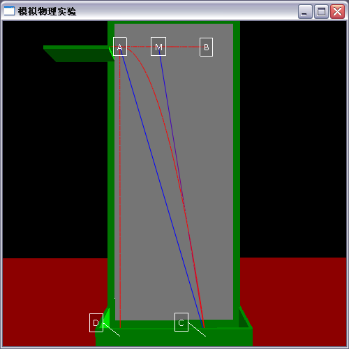

title:物理小球運動實驗的3D模擬動畫
date:2010-05-15-03-29
---

這個本來是學習VPython的第一个練習（目前也是最后一个），想要用于模拟物理实验以便物理老师使用，不过我感觉做的很差劲，就没说过。之后要去参加一个3D动画比赛的，不过可以想象这个模拟效果这么差劲，一看就没前途，再者由于另外的原因这个作品也就没参加。

 暂时不提供下载

之后呢，由于我们班有机械能守恒的物理听课，所以想改一下，用平抛来证明机械能守恒</b><b>。不过据张秉东说，由于用它有些假，所以没被采纳了。

										