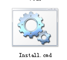

title:发布一个可以开wifi的破解版锐捷
date:2013-09-03-23-12
---
有很多人在学校可能是不使用路由器而用电脑开wifi，虽然很简单，但是还是有很多电脑小白不懂怎么操作。
我特别制作了一个傻瓜版。先解压到硬盘上，然后打开里面的Install.cmd 就安装好了。

桌面上就会多一个开启wifi的快捷方式了。

[**下载**](http://pan.baidu.com/share/link?shareid=3732591548&uk=1326268028)
但是要注意，原来的锐捷要卸载。并且不要直接在压缩软件里运行，必须要解压！解压到硬盘之后的文件夹也不要删除。切记